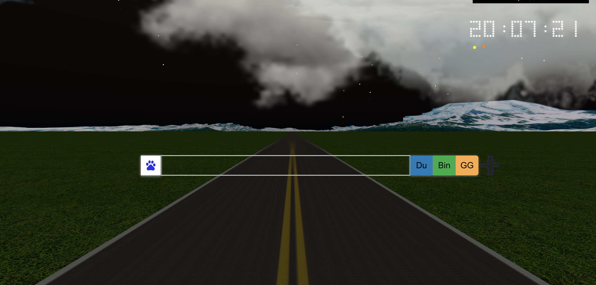

### Underfoot


- This is a front web home index page with dynamic road background demo. Implemented with nodejs, three.js, and Tween.js.


- It will automatically change the weather according to your location. You can change the weather manually in "open controller" on the page.


### Using
```bash
npm install 

#testing:
node app.js

#depolyment:
pm2 start processes.json

```

### Quick view
[underfoot](http://underfoot.zhanxinrui.top/homepage)

### Note
A demo just for fun, it won't be update.
